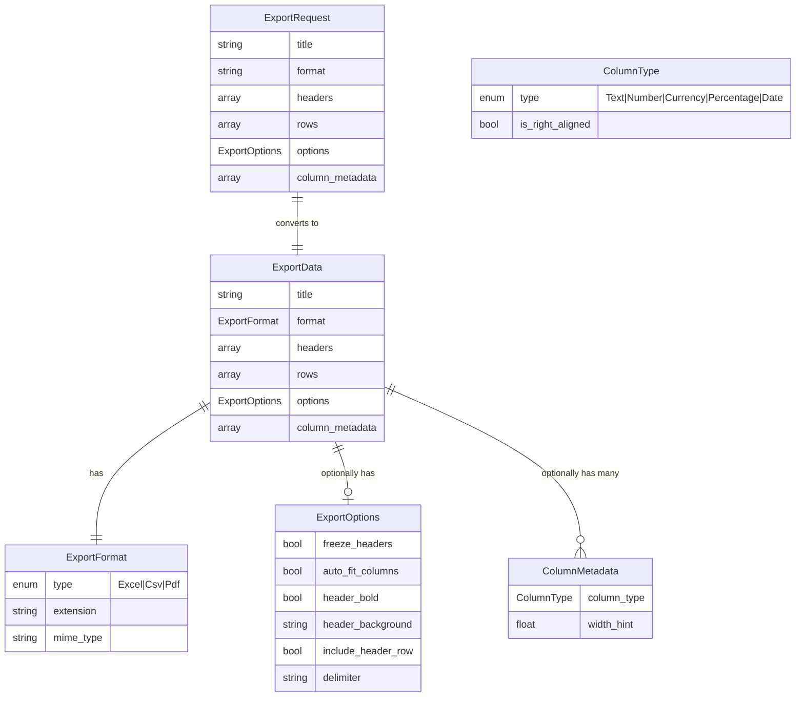
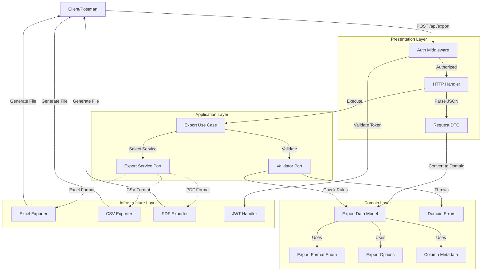
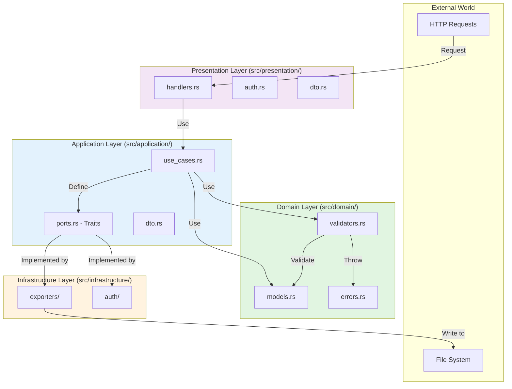
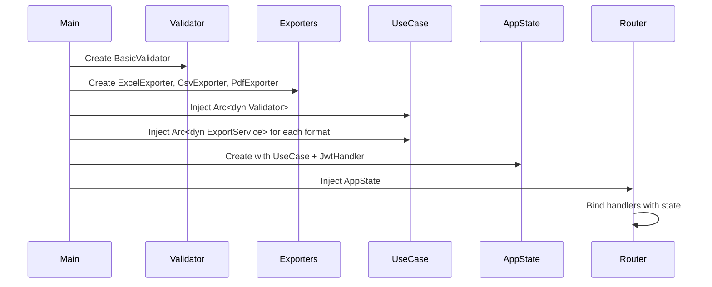
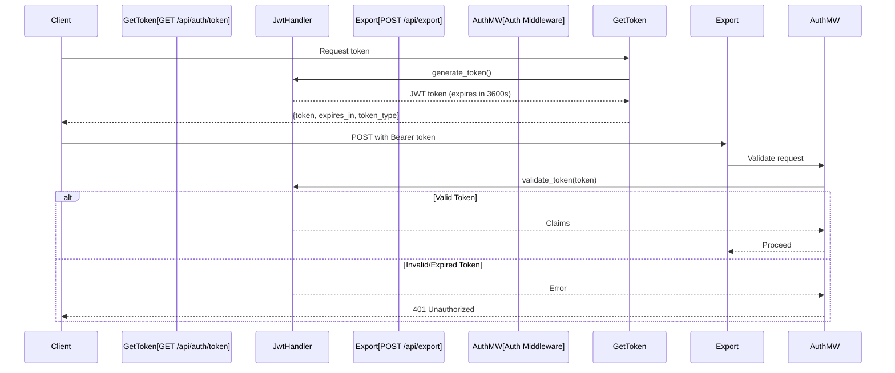
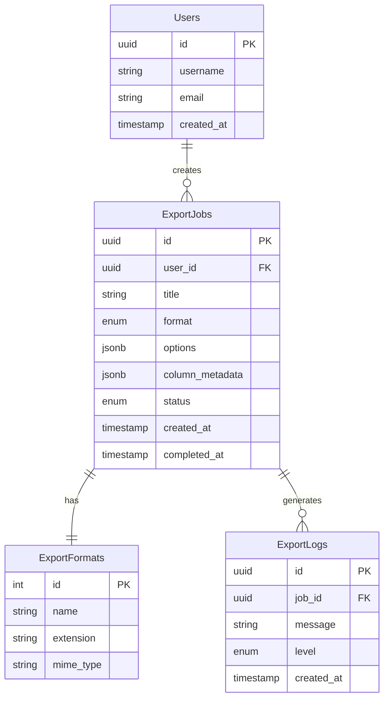

# Entity-Relationship Diagram

## System Architecture Overview

This project uses **Clean Architecture** with clear separation between layers. The ER diagram below shows the relationships between domain entities and how they flow through the system.

---

## Domain Model ER Diagram



---

## Data Flow Diagram



---

## Clean Architecture Layer Relationships



---

## Detailed Entity Descriptions

### 1. ExportRequest (Presentation DTO)
**Location:** `src/presentation/dto.rs` → `src/application/dto.rs`

HTTP request from client that gets converted to domain model.

**Attributes:**
- `title`: Export file name
- `format`: Export format as string ("excel", "csv", "pdf")
- `headers`: Column headers array
- `rows`: Data rows (2D array)
- `options`: Optional formatting options
- `column_metadata`: Optional column type/width information

**Validations:**
- Format must be valid ("excel", "csv", "pdf")
- Converts to `ExportData` domain model

---

### 2. ExportData (Domain Model)
**Location:** `src/domain/models.rs`

Core business entity representing export data.

**Attributes:**
- `title`: String - export title
- `format`: ExportFormat enum
- `headers`: Vec<String> - column headers
- `rows`: Vec<Vec<String>> - data rows
- `options`: Option<ExportOptions>
- `column_metadata`: Option<Vec<ColumnMetadata>>

**Business Rules:**
- Maximum 10,000 rows
- Maximum 1,000 characters per header
- Maximum 1,000 characters per cell
- All rows must have same column count as headers

---

### 3. ExportFormat (Domain Enum)
**Location:** `src/domain/models.rs`

**Values:**
- `Excel` → extension: "xlsx", mime: "application/vnd.openxmlformats-officedocument.spreadsheetml.sheet"
- `Csv` → extension: "csv", mime: "text/csv"
- `Pdf` → extension: "pdf", mime: "application/pdf"

**Methods:**
- `extension()`: Returns file extension
- `mime_type()`: Returns MIME type for HTTP response

---

### 4. ExportOptions (Domain Model)
**Location:** `src/domain/models.rs`

Optional formatting configuration for exports.

**Attributes:**
- `freeze_headers`: Option<bool> - freeze header row (Excel only)
- `auto_fit_columns`: Option<bool> - auto-fit column widths (Excel only)
- `header_bold`: Option<bool> - make headers bold
- `header_background`: Option<String> - header background color (hex)
- `include_header_row`: Option<bool> - include headers in export
- `delimiter`: Option<String> - column delimiter (CSV only)

---

### 5. ColumnMetadata (Domain Model)
**Location:** `src/domain/models.rs`

Metadata for individual columns to control formatting and alignment.

**Attributes:**
- `column_type`: ColumnType enum
- `width_hint`: Option<f32> - suggested column width

**Factory Methods:**
- `text()`, `number()`, `currency()`, `percentage()`, `date()`
- `with_width(width)` - builder method for width

---

### 6. ColumnType (Domain Enum)
**Location:** `src/domain/models.rs`

**Values:**
- `Text` - left-aligned text (default)
- `Number` - right-aligned numbers
- `Currency` - right-aligned currency format
- `Percentage` - right-aligned percentage
- `Date` - date format

**Methods:**
- `is_right_aligned()`: Returns true for Number, Currency, Percentage

---

## Dependency Injection Flow



---

## Validation Rules Diagram

```mermaid
flowchart TD
    Start[ExportData Input]

    CheckRows{rows.len() > 0?}
    CheckMaxRows{rows.len() <= 10000?}
    CheckHeaders{headers.len() > 0?}
    CheckHeaderLen{header.len() <= 1000?}
    CheckRowCols{row.len() == headers.len()?}
    CheckCellLen{cell.len() <= 1000?}

    Valid[Validation Passed]
    Error[Throw DomainError]

    Start --> CheckRows
    CheckRows -->|No| Error
    CheckRows -->|Yes| CheckMaxRows
    CheckMaxRows -->|No| Error
    CheckMaxRows -->|Yes| CheckHeaders
    CheckHeaders -->|No| Error
    CheckHeaders -->|Yes| CheckHeaderLen
    CheckHeaderLen -->|No| Error
    CheckHeaderLen -->|Yes| CheckRowCols
    CheckRowCols -->|No| Error
    CheckRowCols -->|Yes| CheckCellLen
    CheckCellLen -->|No| Error
    CheckCellLen -->|Yes| Valid
```

---

## Export Service Implementations

Each format has its own implementation of the `ExportService` trait:

### Interface (Port)
```rust
pub trait ExportService: Send + Sync {
    fn export(&self, data: &ExportData) -> Result<Vec<u8>, DomainError>;
}
```

### Implementations

1. **ExcelExporter** (`src/infrastructure/exporters/excel.rs`)
   - Uses `rust_xlsxwriter` crate
   - Supports: freeze_headers, auto_fit_columns, header styling

2. **CsvExporter** (`src/infrastructure/exporters/csv.rs`)
   - Uses `csv` crate
   - Supports: custom delimiter

3. **PdfExporter** (`src/infrastructure/exporters/pdf.rs`)
   - Uses `printpdf` crate
   - Supports: header styling, column alignment, Thai fonts

---

## Authentication Flow



---

## Technology Stack

| Layer | Technologies |
|-------|--------------|
| **HTTP Server** | Axum, Tokio |
| **Authentication** | jsonwebtoken |
| **Excel Export** | rust_xlsxwriter |
| **CSV Export** | csv |
| **PDF Export** | printpdf |
| **Serialization** | serde, serde_json |
| **Architecture** | Clean Architecture, DDD |

---

## Database Consideration

**Note:** This application is currently **stateless** and does not use a database. All data is provided via API requests.

### Future Database Schema (if needed)



---

## References

- Clean Architecture: [docs/CLAUDE.md](../CLAUDE.md)
- API Specification: [docs/API_SPEC.md](./API_SPEC.md)
- Source Code: [src/](../src/)
